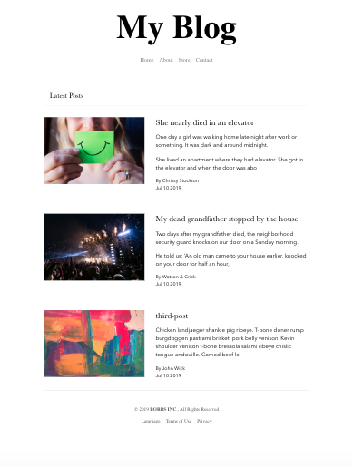
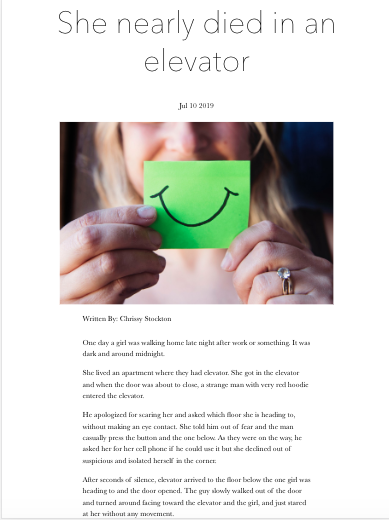
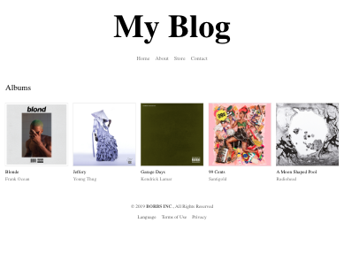
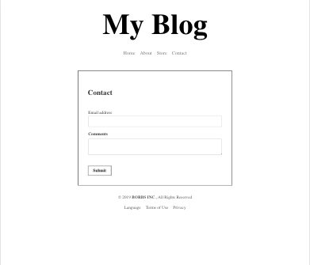

# Nextjs Blogging/portfolio starter with markdown

- Basic tachyons styling use on the template. You can customize it if you want to.

## App Screenshots






## Clone the starter

```javascript
// install the dependencies
$ cd <project name>
$ yarn install

// start up the dev server
$ yarn dev
```

Once you are able to clone the project and start the dev server successfully, navigate to http://localhost:3000/ in your browser to see what we're working with.
